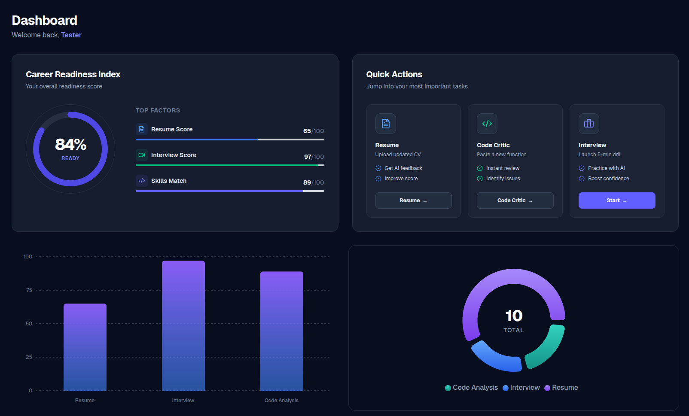
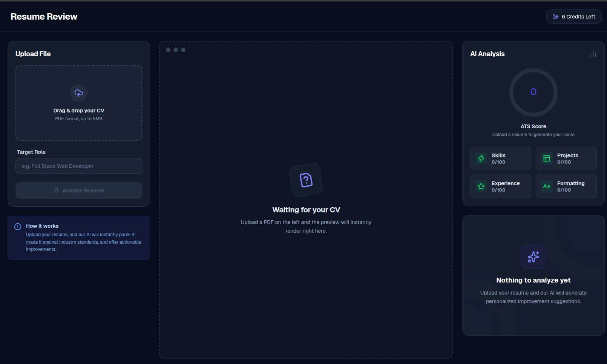
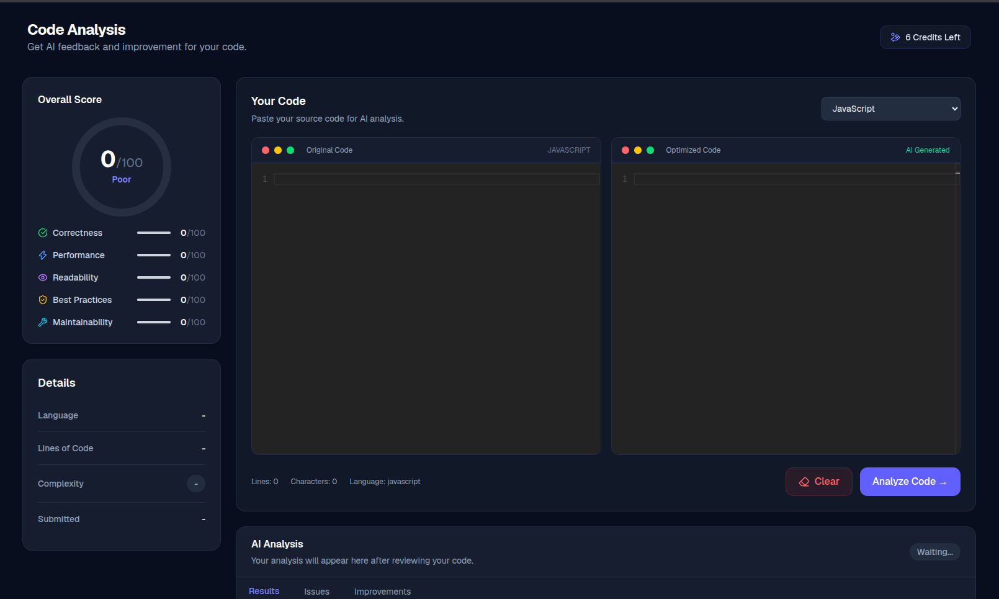
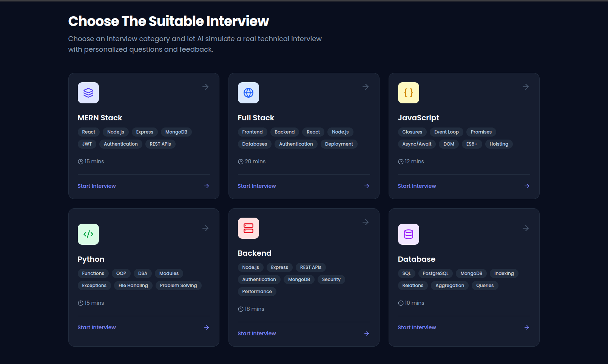

# AI Career Coach

AI-powered career coaching platform that helps developers and job seekers improve their resumes, analyze code and skills, prepare for interviews, and build personalized career roadmaps.

**Live Demo:** https://ai-career-coachz.netlify.app/

## Features

- AI Resume Analysis
- AI Code Analysis
- Skill Gap Analysis
- Personalized Career Roadmaps
- Mock Interview Preparation
- Career Progress Tracking
- AI-powered Career Recommendations
- Google Authentication
- Razorpay Payments

## Screenshots

### Dashboard



### Resume Analysis



### Code Analysis



### Interview Preparation



## Tech Stack

**Frontend:** Next.js, React, TypeScript, Tailwind CSS

**Backend:** Node.js, Express.js

**Database:** PostgreSQL, Prisma

**AI:** Google Gemini API, ElevenLabs

**Authentication:** Google OAuth, JWT

**Payments:** Razorpay

**Email:** Resend

**Deployment:** Netlify, Render

## Environment Variables

### Frontend

Create a `.env.local` file:

```env
NEXT_PUBLIC_GOOGLE_CLIENT_ID=
NEXT_PUBLIC_API_URL=http://localhost:4000/api
NEXT_PUBLIC_RAZORPAY_KEY_ID=
```

### Backend

Create a `.env` file:

```env
DATABASE_URL=
PORT=4000

JWT_SECRET=
NODE_ENV=deployment

FRONTEND_URL=http://localhost:3000

GEMINI_API_KEY=

GOOGLE_CLIENT_ID=
GOOGLE_CLIENT_SECRET=

ELEVENLABS_API_KEY=
ELEVENLABS_VOICE_ID=

RAZORPAY_KEY_ID=
RAZORPAY_KEY_SECRET=

RESEND_API_KEY=
```

> Never commit `.env` or `.env.local` files to GitHub. Keep API keys, database credentials, JWT secrets, and payment secrets private.

## Getting Started

### Clone the repository

```bash
git clone https://github.com/YOUR_USERNAME/YOUR_REPOSITORY.git
cd YOUR_REPOSITORY
```

### Install dependencies

```bash
npm install
```

### Run the project

```bash
npm run dev
```

## Purpose

AI Career Coach brings resume analysis, code analysis, skill-gap detection, interview preparation, and career planning into one AI-powered platform.

## License

MIT
